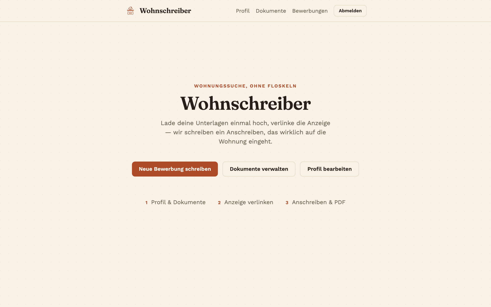
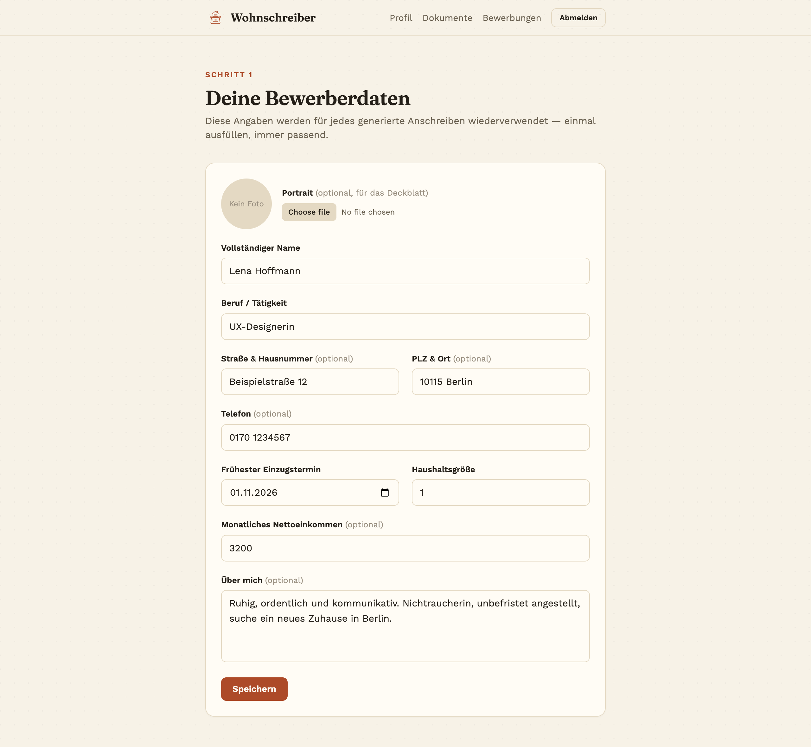
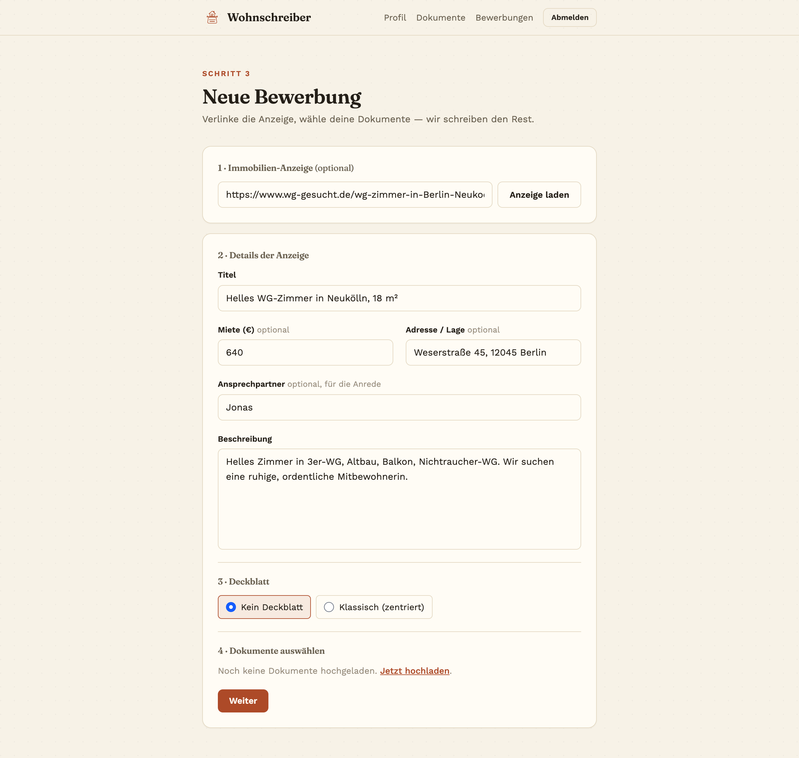
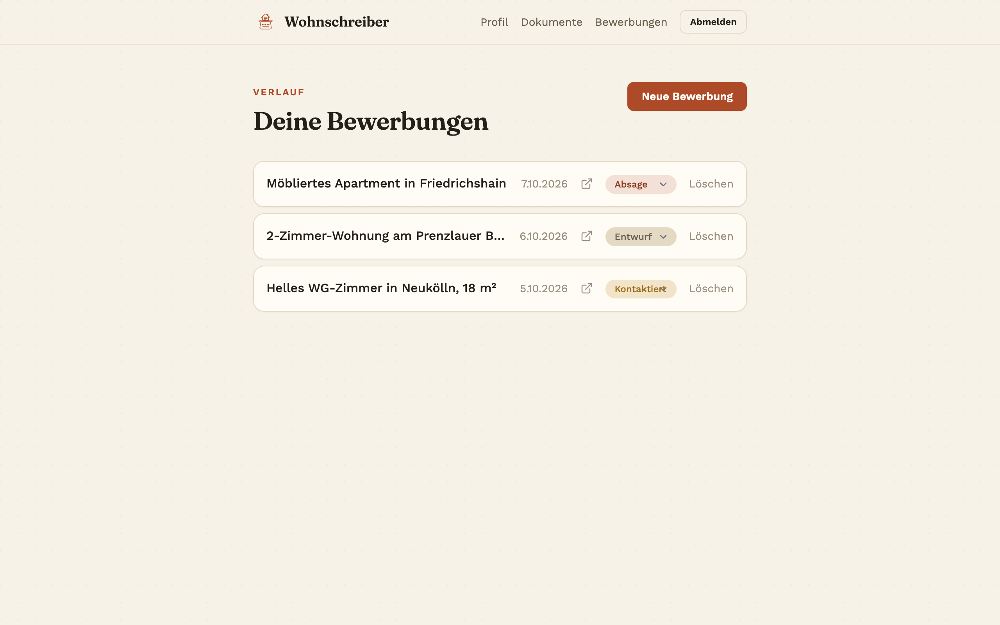
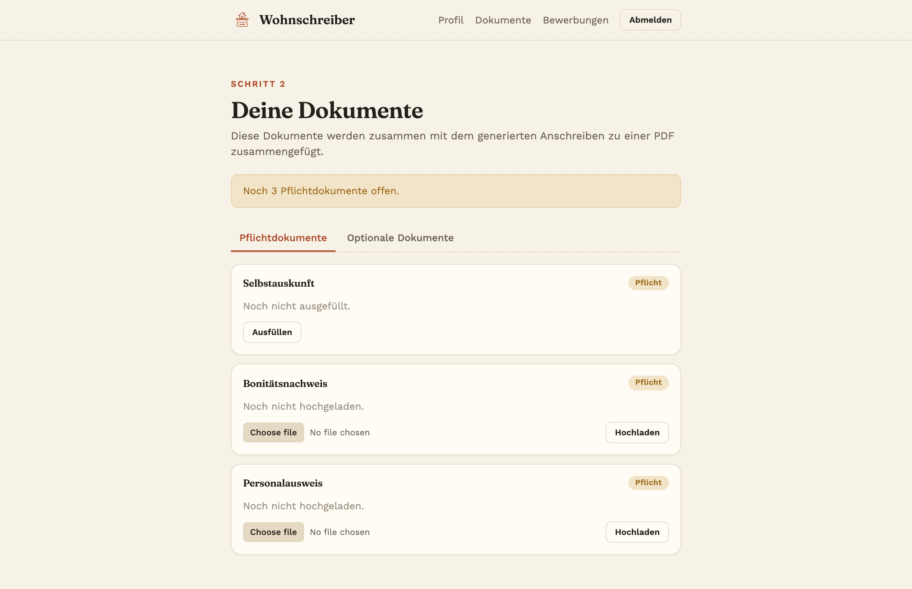

# Wohnschreiber

Apply to rooms and flats faster. Paste a listing URL (WG-Gesucht, Immowelt, ImmoScout24), and
Wohnschreiber scrapes the key facts (rent, address, contact name) and uses Mistral AI to write a
tailored cover letter. It builds a PDF with an optional cover page, your Selbstauskunft and the
documents you pick, all from a profile and document set you fill in once.



## Features

- **One-time profile:** name, occupation, income, move-in date, short bio, optional portrait.
- **Document vault:** upload Selbstauskunft, Schufa, income proofs and more; pick which ones go into each application.
- **Listing import:** extract title, rent, address and contact from a URL, or paste the text manually.
- **AI cover letter:** generated per listing, with clarifying questions where the ad leaves gaps.
- **PDF export:** cover page templates and fonts, images compressed to keep the file under 10 MB.
- **Application history:** track status (draft, contacted, rejected, accepted).
- **i18n:** English and German via Paraglide.

## Screenshots

| Profile | New application |
| --- | --- |
|  |  |

| Applications | Documents |
| --- | --- |
|  |  |

## Stack

SvelteKit (TypeScript), Tailwind CSS, Drizzle ORM (PostgreSQL), better-auth, Paraglide, Playwright
and Vitest, Mistral AI.

## Setup

```sh
bun install
```

Copy `.env.example` to `.env` and fill in the values:

- `DATABASE_URL` — PostgreSQL connection string
- `ORIGIN` — public origin of the app (needed by better-auth)
- `BETTER_AUTH_SECRET` — high-entropy secret (32+ chars in production)
- `MISTRAL_API_KEY` — Mistral AI API key, used to generate applications
- `UPLOAD_DIR` — local directory for uploaded documents/portraits

Start the database (Docker) and push the schema:

```sh
bun run db:start
bun run db:push
```

## Developing

```sh
bun run dev

# or start the server and open the app in a new browser tab
bun run dev -- --open
```

## Building

```sh
bun run build
```

Preview the production build with `bun run preview`.

## Testing & linting

```sh
bun run test        # unit tests + e2e (Playwright)
bun run test:unit    # unit tests only
bun run lint         # prettier + eslint
```

## Deploying (Coolify)

The app ships with a `Dockerfile` (multi-stage, bun-based) building the `adapter-node` output.

1. In Coolify, create a new resource from this git repo — it will detect the `Dockerfile` automatically.
2. Set env vars: `DATABASE_URL`, `ORIGIN` (public URL, e.g. `https://yourapp.example.com`), `BETTER_AUTH_SECRET` (32+ random chars), `MISTRAL_API_KEY`, `UPLOAD_DIR` (e.g. `/app/uploads`).
3. Mount a persistent volume at `UPLOAD_DIR` so uploaded documents survive redeploys.
4. Point `DATABASE_URL` at a Postgres instance (a Coolify-managed Postgres service works fine), then run the schema once against it: `bun run db:push` (or `db:migrate` if you generate migrations) from a machine/shell that can reach that database.
5. The container listens on port `3000` (`HOST=0.0.0.0`, `PORT=3000`, both set in the image) — point Coolify's proxy at that port.

### Listing extraction & bot protection

Pasting a listing URL scrapes the key facts. WG-Gesucht is fetched over plain HTTP.
Immowelt (DataDome) and ImmoScout24 (AWS WAF captcha) sit behind bot protection
that blocks plain HTTP requests **and every headless-browser mode** (vanilla
headless, Chrome's new headless, and patched/stealth builds were all verified to
get 401/403). Only a real **headed** Chromium passes their JS challenge, so those
hosts are rendered with headed Playwright. ImmoScout24 additionally needs an origin
"warmup" visit to obtain a WAF token before the expose loads (handled in
`browser-fetch.ts`).

A headed browser needs a display. In production the `Dockerfile` installs Chromium,
its system libraries and Xvfb, and starts the server with `xvfb-run` — so it runs
windowless on the (display-less) server. This works out of the box in Coolify.

- **Local dev:** browser scraping is **off by default** so no browser window pops
  up while developing (macOS has no Xvfb). Immowelt/ImmoScout URLs then fall back
  to the manual entry fields. Set `ENABLE_BROWSER_SCRAPE=1` to test it locally
  (a Chromium window will open). It is always on when `NODE_ENV=production`.
- The runtime image is larger (~500 MB) and these scrapes take a few seconds.
- DataDome/AWS WAF score datacenter/VPS IPs aggressively. Extraction can still be
  blocked from some hosting IPs; when it is, the app falls back to manual entry.

## Database

```sh
bun run db:generate  # generate a new migration from schema changes
bun run db:migrate   # apply migrations
bun run db:studio    # open Drizzle Studio
```
